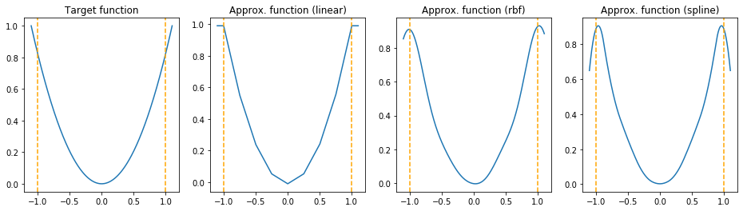
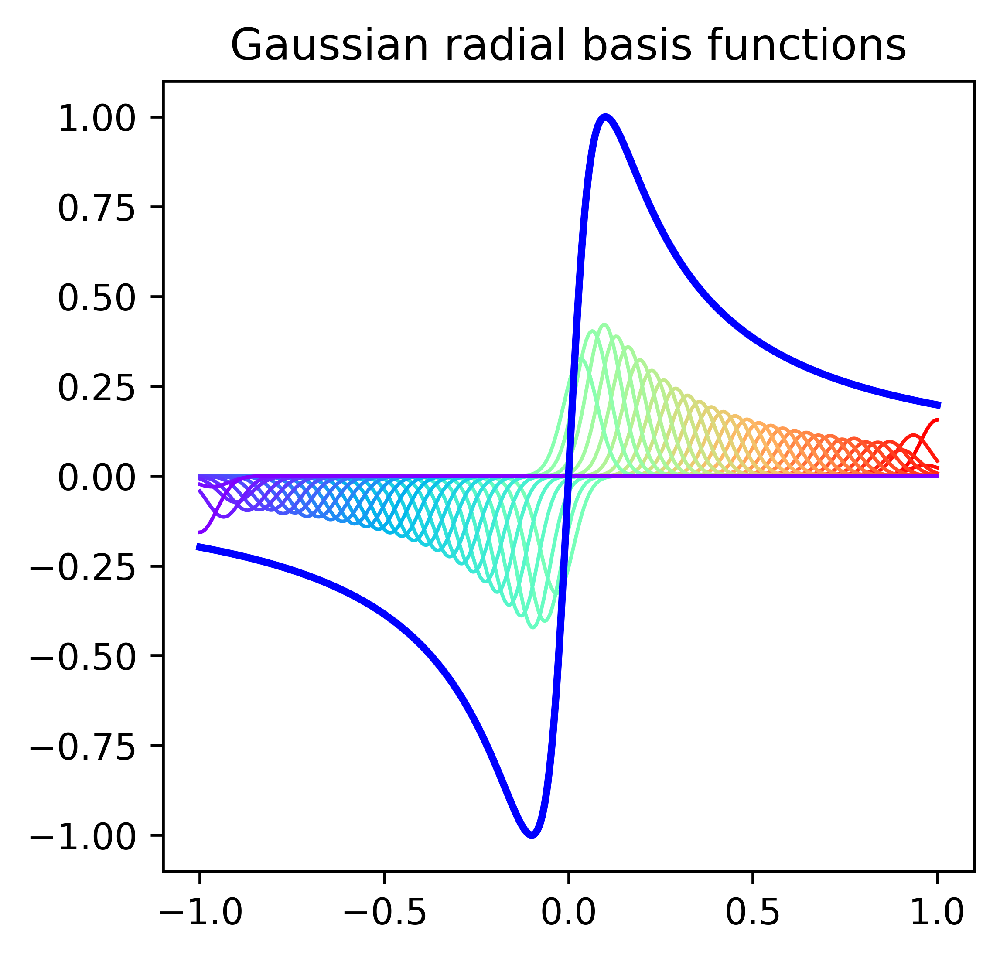

.. _operator:

Operator Class
==============

Interface
----------
Defined in ``operators/ioperator.h``

.. doxygenclass:: optox::IOperator
    :project: optox
    :members:
    :protected-members:

Activations 
----------------------
This package contains trainable activation functions based on

- Gaussian Radial basis functions (RBFs) denoted by *rbf*

- Linear interpolation denoted by *linear*

- B-splines denoted by *spline*

The trainable activation functions are only defined within a support ``[vmin, vmax]``.
Furthermore, the number of nodes (weights) ``Nw`` of the functions have to be defined.
The following example shows a target function, approximated with `linear`, `rbf` and `spline` activations.
The dotted orange lines denote the support, i.e., ``[-1, 1]``.
Please note how values outside of this support are treated for the different functions.
In this example, we selected ``Nw=9`` nodes.

Interface
~~~~~~~~~
Defined in ``operators/activations/act.h``

.. doxygenclass:: optox::IActOperator
    :project: optox
    :members:
    :protected-members:

.. doxygenclass:: optox::IAct2Operator
    :project: optox
    :members:
    :protected-members:

Linear Activations
~~~~~~~~~~~~~~~~~~~~~
Defined in ``operators/activations/act_linear.h``

.. doxygenclass:: optox::LinearActOperator
    :project: optox
    :members:
    :protected-members:

RBF Activations
~~~~~~~~~~~~~~~~~~~~~

The trainable RBF activations :math:`\phi(x)` in :cpp:class:`optox::RBFActOperator` are defined as a weighted combination of Gaussian Radial basis functions. The function is given as

.. math::
    \phi(x) =  0.4 \sum\limits_{i=1}^{N_w} w_i \cdot e^{- \frac{(x - \mu_i)^2}{2 \sigma^2}},

where :math:`w_i` denote the trainable weights, :math:`\mu_i` denote the nodes,
and math:`\sigma` is the standard deviation of the Gaussian. The factor 0.4 is a fixed scaling
that was determined as *reference* scaling at some point. The standard deviation :math:`\sigma`
equals the distance between nodes and is given as

.. math::
    \sigma = \frac{vmin-vmax}{N_w - 1},

where :math:`[vmin,vmax]` defines the support of the function.

We also support trainable activation functions in :cpp:class:`optox::RBFAct2Operator` that return both :math:`\phi(x)` and its first-order
derivative :math:`\phi^\prime(x)` given as

.. math::
    \phi^\prime(x) = 0.4 \sum\limits_{i=1}^{N_w} \frac{\mu_i - x}{\sigma^2} w_i \cdot e^{- \frac{(x - \mu_i)^2}{2 \sigma^2}}.

Defined in ``operators/activations/act_rbf.h``

.. doxygenclass:: optox::RBFActOperator
    :project: optox
    :members:
    :protected-members:

.. doxygenclass:: optox::RBFAct2Operator
    :project: optox
    :members:
    :protected-members:

Spline Activations
~~~~~~~~~~~~~~~~~~~~~
Defined in ``operators/activations/act_spline.h``

.. doxygenclass:: optox::SplineActOperator
    :project: optox
    :members:
    :protected-members:

Averagepooling
---------------

.. warning::
    C++/CUDA code requires cleanup to adapt to make use of built-in methods, shapes, etc.

.. todo::
    Documentation

Defined in ``operators/averagepooling_operator.h``

.. doxygenclass:: optox::AveragePooling2d_Operator
    :project: optox
    :members:
    :protected-members:

.. doxygenclass:: optox::AveragePooling3d_Operator
    :project: optox
    :members:
    :protected-members:

Demosaicing
-----------

Defined in ``operators/demosaicing_operator.h``

.. doxygenenum:: optox::BayerPattern
    :project: optox

.. doxygenclass:: optox::DemosaicingOperator
    :project: optox
    :members:
    :protected-members:

Maxpooling
-----------

.. warning::
    C++/CUDA code requires cleanup to adapt to make use of built-in methods, shapes, etc.

.. todo::
    Documentation

Defined in ``operators/maxpooling_operator.h``

.. doxygenclass:: optox::MaxPooling2d_Operator
    :project: optox
    :members:
    :protected-members:

.. doxygenclass:: optox::MaxPooling3d_Operator
    :project: optox
    :members:
    :protected-members:

Nabla - First-Order Derivatives
-------------------------------
Defined in ``operators/nabla_operator.h``

.. doxygenclass:: optox::NablaOperator
    :project: optox
    :members:
    :protected-members:

Nabla2 - Second-Order Derivatives
----------------------------------
Defined in ``operators/nabla2_operator.h``

.. doxygenclass:: optox::Nabla2Operator
    :project: optox
    :members:
    :protected-members:

Pad
-----------
Defined in ``operators/pad_operator.h``

.. doxygenenum:: optox::PaddingMode
    :project: optox

.. doxygenclass:: optox::Pad1dOperator
    :project: optox
    :members:
    :protected-members:

.. doxygenclass:: optox::Pad2dOperator
    :project: optox
    :members:
    :protected-members:

.. doxygenclass:: optox::Pad3dOperator
    :project: optox
    :members:
    :protected-members:

.. todo::
    **Feature request:** 4D padding

Rotation
-----------
Defined in ``operators/rot_operator.h``

.. doxygenclass:: optox::RotOperator
    :project: optox
    :members:
    :protected-members:

Warp
-----------
Defined in ``operators/warp_operator.h``

.. doxygenenum:: optox::WarpMode
    :project: optox

.. doxygenclass:: optox::WarpOperator
    :project: optox
    :members:
    :protected-members: